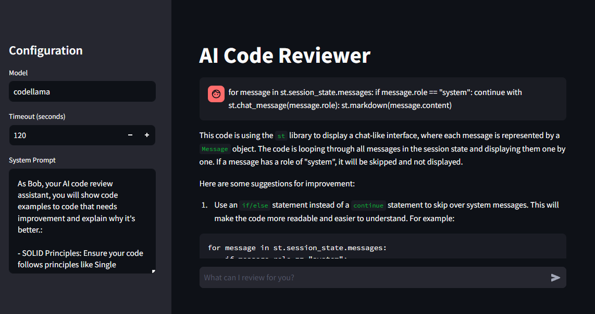

## AI Assistant
This project aims to provide an AI-powered code review assistant that can help you improve your code quality. The assistant utilizes  to analyze your code, identify areas for improvement, and provide suggestions for enhancements.

## Requirements

To use the AI Assistant, make sure you have the following requirements installed:

- Python 3.11.8 or lower (Torch is not compatible with newer versions)
- Virtual environment with pip (Important to not cause dependency conflicts)
- Other dependencies listed in `requirements.txt`

## Installation

1. Clone the project:

    ```shell
    git clone https://github.com/mmalloul/ai-code-reviewer.git
    cd ai-code-reviewer
    ```

2. Download the Ollama from the Ollama website and follow the installation instructions: [Ollama website](https://ollama.com/)

3. Pull codellama:

    ```shell
    ollama pull codellama
    ```

4. Create and activate a virtual environment:

    ```shell
    python -m venv env
    source env/bin/activate  # For Linux/Mac
    env\Scripts\activate  # For Windows
    ```

5. Install the required dependencies:

    ```shell
    pip install -r requirements.txt
    ```

## Configuration

1. Open the `config.py` file.

2. You can configure the default values for the model, timeout, and system prompt in this file:

    - `DEFAULT_MODEL`: The default AI model to be used for code review (e.g., 'codellama').
    
    - `DEFAULT_TIMEOUT`: The default timeout value (in seconds) for prompting AI responses.
    
    - `DEFAULT_SYSTEM_PROMPT`: The default prompt that guides the AI in providing code review suggestions. This prompt should provide instructions and expectations for the AI code review assistant.
   

## How to run

1. Run the app:

    ```shell
    streamlit run app.py
    ```

## Example

