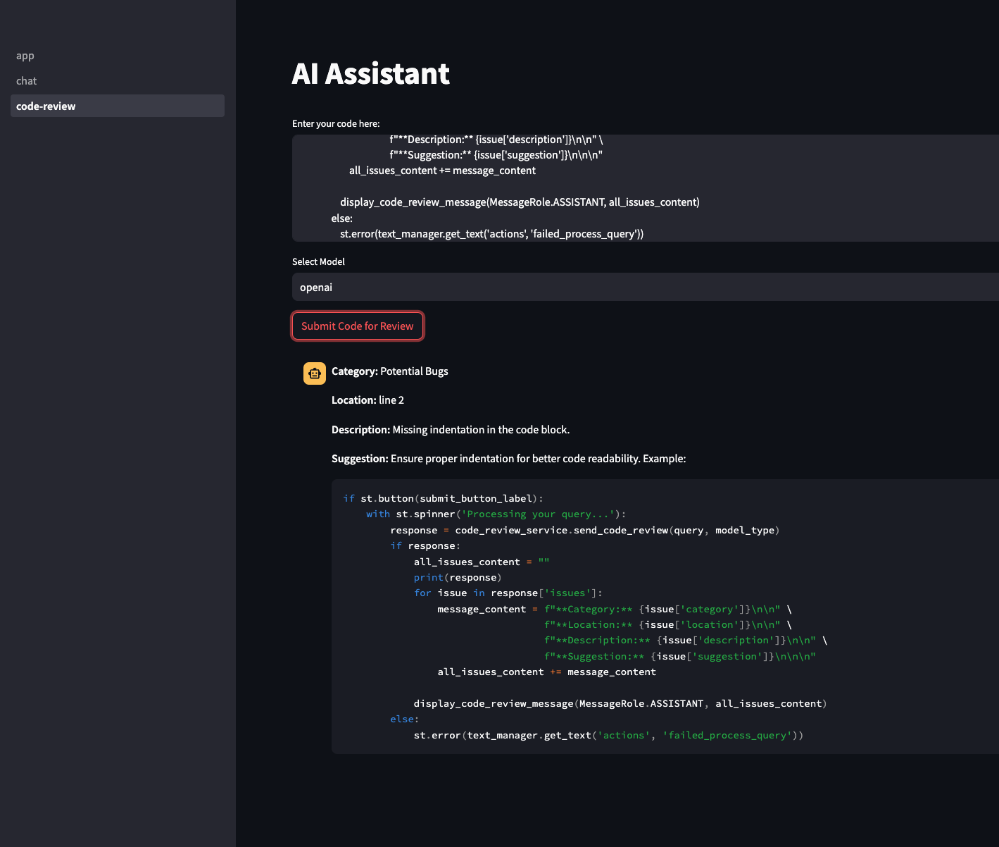

## AI Assistant
This project delivers an AI-powered assistant designed to aid in various tasks, such as code review, document analysis, and interactive queries. The assistant utilizes a language model from Ollama, allowing you to interact with it based on your input. The project defaults to using the "codellama" model from Ollama's extensive model library, but you are encouraged to explore and utilize other models available at the [Ollama website](https://ollama.com/library).

## Changelog

Stay informed about the latest updates by checking our changelog [here](CHANGELOG.md).

## Requirements

Ensure you meet the following requirements before setting up the AI Assistant:

- Python 3.11.8 or earlier (compatibility issues exist with newer versions due to Torch dependencies).
- A virtual environment, ideally managed via `venv` or a similar tool, to manage Python packages without conflicts.
- Installation of additional Python packages as specified in the `requirements.txt` file.
- Active Ollama background service, necessary for the model functionalities.

## Installation

Follow these steps to get started with the AI Assistant:

1. **Clone the Repository**:
    ```shell
    git clone https://github.com/mmalloul/ai-assistant.git
    cd ai-assistant
    ```

2. **Model Setup**:
   - Download your desired Ollama model from the [Ollama website](https://ollama.com/).
   - For the codellama model:
     ```shell
     ollama pull codellama
     ```

3. **Environment Setup**:
    ```shell
    python -m venv env
    source env/bin/activate  # For Linux/Mac
    env\Scripts\activate  # For Windows
    ```

4. **Install Dependencies**:
    ```shell
    pip install -r requirements.txt
    ```

## Configuration

Modify settings in the `config.py` file as needed:

- `BACKEND_URL`: LLM Backend Micro Service

## Running the Application

Launch streamlit frontend using the following command:
```shell
cd streamlit
streamlit run app.py
```

Launch the backend using the following command:
```shell
cd .. # if you are not in the root of the project
cd backend
python -m app.main
```
## Example
